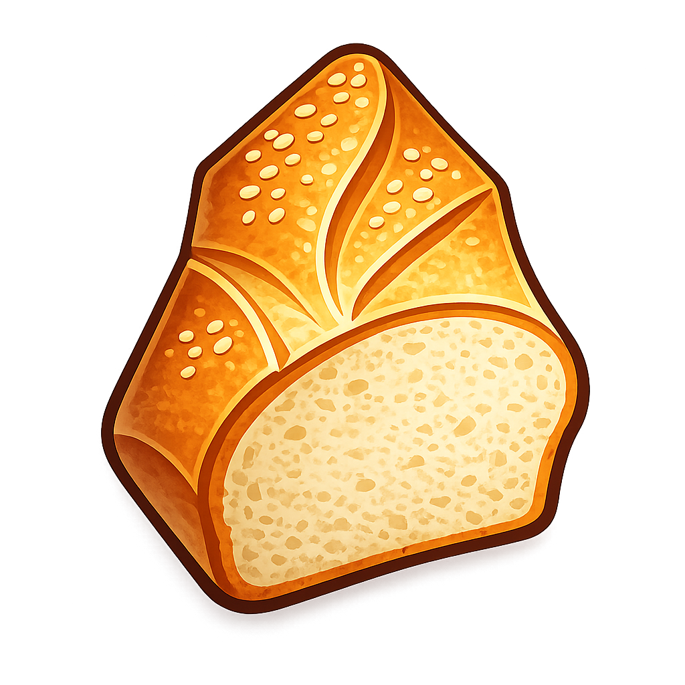

<div align="center">
  
  <h1>Obsidian Image Baker</h1>
</div>

[](https://github.com/bartekmp/obsidian-image-baker/actions/workflows/ci.yml)
[](https://github.com/bartekmp/obsidian-image-baker/releases)

An [Obsidian](https://obsidian.md) plugin that **bakes images into your notes** as self-contained
Base64 embeds — and un-bakes them back into regular files whenever you want.

## Why would I want this?

**Your notes travel as single files.** A note with baked-in images is one `.md` file that carries
its own pictures. Mail it, paste it into a gist, sync it, move it between vaults — nothing breaks,
no attachment folder needs to come along.

**Screenshots stop cluttering your vault.** If your workflow is screenshot-heavy — meeting notes,
bug reports, study notes, recipes — every paste normally creates another `Pasted image 1748….png`
in your attachment folder. With Image Baker the screenshot lands *inside* the note it belongs to,
and nowhere else.

**Images live and die with their note.** A baked image exists only in the note that uses it.
Delete the note and the image is gone with it — no orphaned attachments to hunt down later, no
"is anything still using this file?" anxiety.

**It's reversible, so there's nothing to commit to.** Every conversion works both ways, down to
the original file name and folder. Bake a note, change your mind, extract — you're back exactly
where you started. Try it on one note or convert a whole vault, with a dry-run preview either way.

## What it does

### Getting images in

- **Paste or drag & drop** an image and it is baked straight into the note — no attachment file
  is ever created. Dropped files keep their real name; pasted screenshots get a clean
  `<note name> <timestamp>.png` name. Anything that isn't a supported image within the size
  limit is left to Obsidian's normal handling.
- **Convert existing images** — wiki embeds (`![[photo.png|300]]`) and markdown images
  (``) convert in place: per image, per selection, per note, or across the
  whole vault.
- **Optional optimization** — re-encode to WebP or JPEG (configurable quality, optional
  downscaling) while baking, typically shrinking screenshots several-fold. Only used when the
  result is actually smaller; SVG and GIF are never touched.

### Getting images out

- **Extract** any embed back into a real file — original name, sizing, and folder restored, name
  collisions resolved, duplicate embeds extracted once.
- **Copy image** puts the pixels back on your clipboard for use in any other app.

### Everyday handling

- **Right-click works everywhere**: a rendered image in the note (extract / copy / reset size /
  delete), an image link in source mode, an image file in the file explorer (*Embed image into
  notes that use it*), or a note in the file explorer (embed/extract all of its images).
- **Click an image, run a command**: *Embed / Extract / Copy selected image* act on the image
  you clicked or the link under your cursor.
- **Collapsed embed data** — the editor folds the long Base64 text behind a small
  `base64 · 142 KB` pill; click to expand, move away to fold again.
- **Image list sidebar** — every image of the current note with badges, jump-to-image on click,
  per-image Bake/Extract buttons, and multi-select with batch conversion.
- **Batch dialogs** show a dry-run summary first ("Found 214 embeddable images (~38 MB) in 96
  notes."), report progress, and can be aborted mid-run.

### Safe by design

- Source files are **moved to the trash, never hard-deleted** — and only when no other note
  still references them. Deletion can be turned off entirely.
- Notes are modified atomically; image links inside code blocks are ignored.
- Oversized images are skipped (1 MB by default, configurable) instead of silently bloating
  notes.
- Every operation is logged to the developer console at a configurable level (settings →
  *Log level*), so unexpected behavior is easy to diagnose.

## Settings

| Setting | Default | Description |
| --- | --- | --- |
| Collapse embedded image data | on | Fold Base64 payloads behind a size pill |
| Embed images on paste | on | Bake pasted images straight into the note |
| Embed images on drop | on | Bake dragged-in images straight into the note |
| Delete source files after embedding | on | Trash the original file once baked in |
| Maximum file size to embed (KB) | 1024 | Skip images larger than this (0 = no limit) |
| Optimize images before embedding | off | Re-encode images while baking them in |
| Optimized format / quality / max width | WebP / 75 / 0 | Target encoding for optimization |
| Extracted link style | Wikilink | `![[image.png]]` or `` |
| Log level | Warnings | Event logging: Off, Errors, Warnings, Info, Debug |

## Good to know

- **Base64 makes notes larger** — roughly a third over the raw image size. The size limit and
  optimization settings keep this under control.
- **Bases / card views don't render baked images** — inherent to data-URI images; extract the
  image back to a file if you need it there.
- **Publishing depends on the renderer** — Obsidian renders baked images everywhere, but some
  external markdown renderers strip them (GitHub notably does). Extract before publishing there.
- **Excalidraw and Canvas are out of scope** — both store image references in JSON, not
  markdown.
- **Mobile paste is untested** so far; everything else is platform-neutral.

## Installation

### From the community plugin list

Once accepted into the community catalog: **Settings → Community plugins → Browse**, search for
"Image Baker".

### With BRAT

Install the [BRAT](https://github.com/TfTHacker/obsidian42-brat) plugin and add
`bartekmp/obsidian-image-baker` as a beta plugin.

### Manual

Download `main.js`, `manifest.json`, and `styles.css` from the
[latest release](https://github.com/bartekmp/obsidian-image-baker/releases) and place them in
`<your vault>/.obsidian/plugins/image-baker/`, then enable the plugin in
**Settings → Community plugins**.

## Developing

```bash
git clone https://github.com/bartekmp/obsidian-image-baker.git
cd obsidian-image-baker
npm ci
npm run dev      # watch mode; clone into a test vault's .obsidian/plugins/image-baker/
npm test         # unit tests
npm run build    # production build → main.js
```

Contributions are welcome — see [CONTRIBUTING.md](CONTRIBUTING.md) for the branch, commit, and
release conventions.

## LLM policy

The TypeScript source code in this repository is mainly generated with the LLM assistance.

## License

[MIT](LICENSE)
